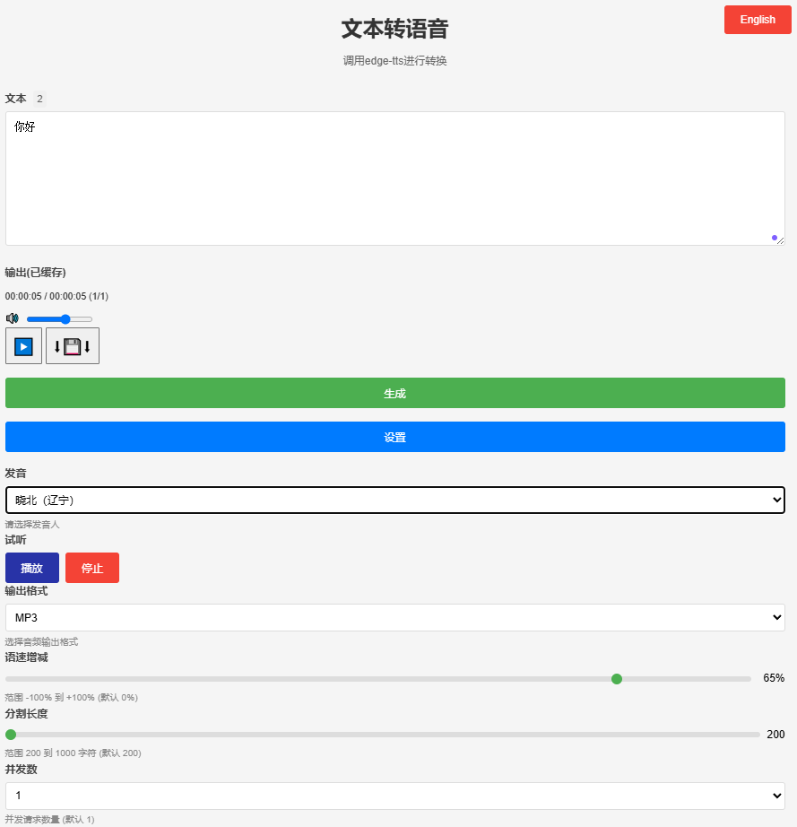

# edge-tts-webui (HTML)

## 简介

`edge-tts-webui` 是一个基于 HTML、JavaScript 和 Nginx 的轻量级 Web 界面，用于将文本转换为语音（Text-to-Speech, TTS）。该项目最初是为了配合 OCR 数据核对，通过 TTS 功能将文本转为语音以便人工校验。由于官方 `edge-tts` 没有提供管理界面，作者参考了 [ycyy/edge-tts-webui](https://github.com/ycyy/edge-tts-webui)（基于 Gradio 开发），并使用 [Grok](https://grok.com/) 重写为纯前端实现，避免引入额外的 Python 依赖。

本项目通过 Docker 部署，结合 Nginx 解决跨域问题，支持多语言界面（中英文）、多种音色选择、语速调整、并发音频生成等功能。只需 Docker 环境即可快速运行，无需额外安装复杂依赖。



## 功能特性

- **文本转语音**：将输入的文本分段转换为音频，支持 MP3、WAV、AAC 和 OGG 格式。
- **多语言支持**：提供中英文界面切换。
- **音色选择**：支持多种中文音色（如晓晓、云健等），并可预览示例音频。
- **语速调整**：支持 -100% 至 +100% 的语速调节。
- **分段控制**：文本按指定长度（200-1000字符）分割，支持并发请求生成音频。
- **音频播放与下载**：实时播放生成的音频，并支持将完整音频下载为单一文件。
- **并发优化**：可配置并发请求数量，提升生成效率。
- **Docker 部署**：通过 Nginx 解决跨域问题，适用于本地或容器化环境。

## 技术栈

- **前端**：HTML, CSS, JavaScript
- **后端服务**：依赖 `travisvn/openai-edge-tts` Docker 镜像提供的 TTS API
- **部署**：Nginx + Docker
- **国际化**：支持中英文切换（`i18n.js`）

## 部署步骤

### 前提条件

- 已安装 Docker 和 Git。
- 确保本地网络允许容器间通信（Windows/Mac 需要支持 `host.docker.internal`）。

### 1. 部署 edge-tts 服务

`edge-tts-webui` 依赖后端 TTS 服务，以下是部署步骤：

#### 拉取镜像
```bash
docker pull travisvn/openai-edge-tts:latest
```

#### 运行服务
```bash
docker run -d -p 5050:5050 \
    --name open-edge-tts \
    --restart always \
    --network openwebui-network \
    -e API_KEY=b4297f4c-5795-4427-ad51-049e5c1ad215 \
    -e PORT=5050 \
    -e DEFAULT_VOICE=zh-CN-YunjianNeural \
    -e DEFAULT_RESPONSE_FORMAT=mp3 \
    -e DEFAULT_SPEED=1.0 \
    -e DEFAULT_LANGUAGE=zh_CN \
    -e REQUIRE_API_KEY=True \
    -e REMOVE_FILTER=False \
    -e EXPAND_API=True \
    travisvn/openai-edge-tts:latest
```

- **说明**：
  - `API_KEY`：用于认证请求，需与前端代码中的 `Authorization` 保持一致。
  - `PORT`：服务监听端口，默认 5050。
  - `--network`：可选，若有自定义网络可指定。

### 2. 部署 edge-tts-webui

#### 拉取 Nginx 镜像
```bash
docker pull nginx:1.27
```

#### 获取项目代码
```bash
git clone https://github.com/your-username/edge-tts-webui.git
cd edge-tts-webui
```

> **注**：请将 `your-username` 替换为实际的 GitHub 用户名和仓库地址。

#### 运行 Web 界面

- **Linux**
```bash
docker run -p 80:80 -d \
    --add-host=host.docker.internal:host-gateway \
    --name nginx-edge-tts \
    -v $(pwd)/edge-tts-webui:/usr/share/nginx/html \
    -v $(pwd)/edge-tts-webui/nginx-conf/nginx.conf:/etc/nginx/nginx.conf \
    --restart always \
    nginx:1.27
```

- **Windows**
```bash
docker run -p 80:80 -d \
    --add-host=host.docker.internal:host-gateway \
    --name nginx-edge-tts-webui \
    -v D:\github\edge-tts-webui:/usr/share/nginx/html \
    -v D:\github\edge-tts-webui\nginx-conf\nginx.conf:/etc/nginx/nginx.conf \
    --restart always \
    nginx:1.27
```

- **参数说明**：
  - `--add-host`：解决 Docker 容器访问宿主机服务的问题。
  - `-v`：挂载本地项目目录和 Nginx 配置文件。
  - `-p 80:80`：将容器 80 端口映射到宿主机的 80 端口。

### 3. 使用

- 打开浏览器，访问 `http://localhost`。
- 输入文本，选择音色、语速等参数，点击“Generate”生成音频。
- 生成完成后可播放或下载音频文件。

## 配置说明

### 支持的音色
当前支持以下中文音色（可在 `index.html` 中修改）：
- `zh-CN-XiaoxiaoNeural`（晓晓）
- `zh-CN-XiaoyiNeural`（晓伊）
- `zh-CN-YunjianNeural`（云健，默认）
- `zh-CN-YunxiNeural`（云希）
- `zh-CN-YunxiaNeural`（云夏）
- `zh-CN-YunyangNeural`（云扬）
- `zh-CN-liaoning-XiaobeiNeural`（晓北，辽宁）
- `zh-CN-shaanxi-XiaoniNeural`（晓妮，陕西）

非中文音色可参考 [tts.travisvn.com](https://tts.travisvn.com) 自行添加。

### Nginx 配置
`nginx.conf` 已配置反向代理和 CORS，支持从前端调用后端 TTS API：
- 代理地址：`http://host.docker.internal:5050/v1/audio/speech`
- 支持方法：GET, POST, OPTIONS
- 允许所有来源访问（`*`）

### 自定义修改
- **音色**：修改 `index.html` 中的 `<select id="voices">` 选项。
- **API 密钥**：确保 `audio.js` 中的 `Authorization` 与后端 `API_KEY` 一致。
- **分段长度**：调整 `split-slider` 的 `min`、`max` 和 `step` 属性。

## 文件结构

```
edge-tts-webui/
├── index.html         # 主页面
├── style.css          # 样式文件
├── js/
│   ├── audio.js       # 音频处理逻辑
│   ├── i18n.js        # 国际化支持
│   ├── main.js        # 初始化逻辑
│   └── ui.js          # UI 事件处理
├── nginx-conf/
│   └── nginx.conf     # Nginx 配置文件
├── pic/
│   └── edge-tts-webui.png  # 项目截图
└── README.md          # 本文档
```

## 注意事项

1. **跨域问题**：若未使用 Docker 或遇到跨域错误，请检查 Nginx 配置和网络设置。
2. **音频示例**：预览音色需确保 `example/` 目录下有对应 `.wav` 文件。
3. **性能**：高并发设置可能受限于网络和后端服务能力，建议根据实际需求调整 `concurrency`。

## 贡献

欢迎提交 Issue 或 Pull Request 来改进项目，例如：
- 添加更多音色支持
- 优化并发处理性能
- 增强 UI 交互体验

## 许可

本项目采用 MIT 许可证，详情请见 [LICENSE](LICENSE) 文件（若无请自行添加）。