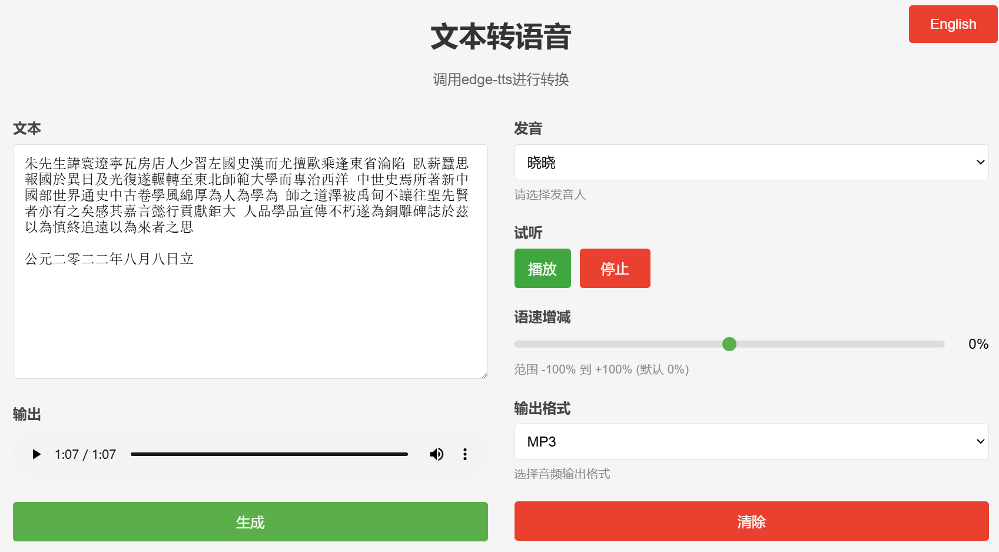

# edge-tts-webui(HTMl)
## 简介
为了测试 OCR 功能核对数据，所以需要使用 TTS 来听文本核对，但 edge-tts 本身没有管理端，所以查询了github 发现[ycyy/edge-tts-webui](https://github.com/ycyy/edge-tts-webui)采用gradio进行开发的，但我不太想安装其他python包，所以就用 [Grok](https://grok.com/) 翻写了整个项目，并加了一点点功能。只要你有docker 就不需要安装直接使用。

之所以使用docker主要解决跨域问题，因为我的 edge-tts 是在 docker内启动的


## 部署
- 拉去 edge-tts 镜像 

    ```bash
    docker pull travisvn/openai-edge-tts:latest
    ```
- 运行 edge-tts 服务 

    ```bash
    docker run -d -p 5050:5050 \
        --name open-edge-tts \
        --restart always \
        --network openwebui-network \
        -e API_KEY=b4297f4c-5795-4427-ad51-049e5c1ad215 \
        -e PORT=5050 \
        -e DEFAULT_VOICE=zh-CN-YunjianNeural \
        -e DEFAULT_RESPONSE_FORMAT=mp3 \
        -e DEFAULT_SPEED=1.0 \
        -e DEFAULT_LANGUAGE=zh_CN \
        -e REQUIRE_API_KEY=True \
        -e REMOVE_FILTER=False \
        -e EXPAND_API=True \
        travisvn/openai-edge-tts:latest
    ```
- 运行 edge-tts-webui

    ```bash
    docker run -p 80:80 -d \
        --add-host=host.docker.internal:host-gateway \
        --name nginx-edge-tts \
        -v ./edge-tts-webui:/usr/share/nginx/html \
        -v ./edge-tts-webui/nginx-conf/nginx.conf:/etc/nginx/nginx.conf  \
        nginx:1.27
    ```
- 使用

    使用浏览器访问

    localhost