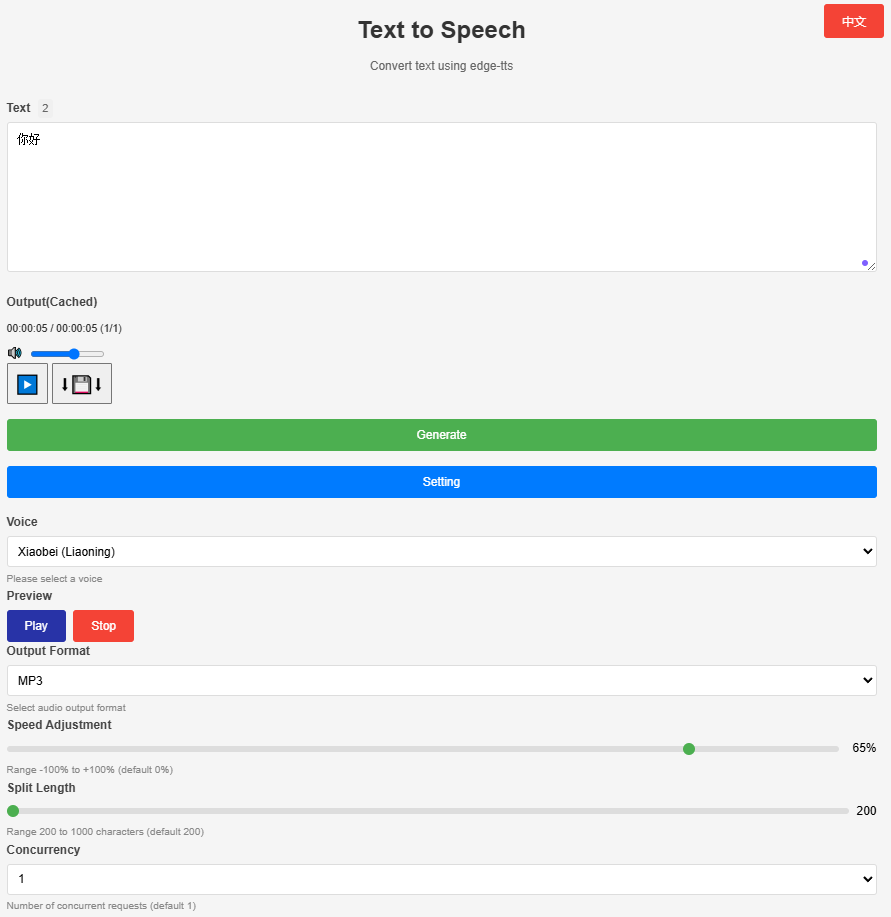

# edge-tts-webui (HTML)
## Introduction
`edge-tts-webui` is a lightweight web interface based on HTML, JavaScript, and Nginx, designed for Text-to-Speech (TTS) conversion. Initially developed to complement OCR data verification by converting text into speech for manual validation, this project lacks an official management interface. Inspired by [ycyy/edge-tts-webui](https://github.com/ycyy/edge-tts-webui), which is based on Gradio, the author has rewritten it as a pure frontend implementation using Grok to avoid introducing additional Python dependencies.
Deployed via Docker and combined with Nginx to resolve cross-origin issues, this project supports multi-language interfaces (Chinese-English), multiple voice options, speed adjustment, and concurrent audio generation. All you need is a Docker environment to run it quickly without complex dependency installations.

## Features
- **Text-to-Speech**: Segments the input text into audio files in formats like MP3, WAV, AAC, and OGG.
- **Multi-language Support**: Switch between Chinese and English interfaces.
- **Voice Options**: Supports various Chinese voices (e.g., Xiaoxiao, Yunjian) with preview examples.
- **Speed Adjustment**: Adjusts speed from -100% to +100%.
- **Segment Control**: Text is split into segments based on a specified length (200-1000 characters), supporting concurrent requests for audio generation.
- **Audio Playback and Download**: Real-time playback of generated audio, with the option to download as a single file.
- **Concurrency Optimization**: Configurable number of concurrent requests to improve generation efficiency.
- **Docker Deployment**: Uses Nginx to resolve cross-origin issues, suitable for both local or containerized environments.
## Technology Stack
- **Frontend**: HTML, CSS, JavaScript
- **Backend Service**: Dependent on TTS API provided by `travisvn/openai-edge-tts` Docker image
- **Deployment**: Nginx + Docker
- **Internationalization**: Supports Chinese-English switching (`i18n.js`)
## Deployment Steps
### Prerequisites
- Docker and Git are installed.
- Ensure that the local network allows communication between containers (Windows/Mac require support for `host.docker.internal`).
### 1. Deploy edge-tts Service
`edge-tts-webui` depends on a backend TTS service, follow these steps:
#### Pull Image
```bash
docker pull travisvn/openai-edge-tts:latest
```
#### Run the Service
```bash
docker run -d -p 5050:5050 \
    --name open-edge-tts \
    --restart always \
    --network openwebui-network \
    -e API_KEY=b4297f4c-5795-4427-ad51-049e5c1ad215 \
    -e PORT=5050 \
    -e DEFAULT_VOICE=zh-CN-YunjianNeural \
    -e DEFAULT_RESPONSE_FORMAT=mp3 \
    -e DEFAULT_SPEED=1.0 \
    -e DEFAULT_LANGUAGE=zh_CN \
    -e REQUIRE_API_KEY=True \
    -e REMOVE_FILTER=False \
    -e EXPAND_API=True \
    travisvn/openai-edge-tts:latest
```
- **Note**:
  - `API_KEY`: Used for request authentication, must match the value in the frontend code.
  - `PORT`: Service listens on port 5050 by default.
  - `--network`: Optional. Specify custom network if needed.
### 2. Deploy edge-tts-webui
#### Pull Nginx Image
```bash
docker pull nginx:1.27
```
#### Get Project Code
```bash
git clone https://github.com/your-username/openai-edge-tts-webui.git
cd openai-edge-tts-webui
```
> **Note**: Replace `your-username` with your actual GitHub username and repository address.
#### Run the Web Interface
- **Linux**
```bash
docker run -p 80:80 -d \
    --add-host=host.docker.internal:host-gateway \
    --name nginx-edge-tts \
    -v $(pwd)/openai-edge-tts-webui:/usr/share/nginx/html \
    -v $(pwd)/openai-edge-tts-webui/nginx-conf/nginx.conf:/etc/nginx/nginx.conf \
    --restart always \
    nginx:1.27
```
- **Windows**
```bash
cd 
docker run -p 80:80 -d \
    --add-host=host.docker.internal:host-gateway \
    --name nginx-edge-tts-webui \
    -v d:\github\openai-edge-tts-webui:/usr/share/nginx/html \
    -v d:\github\openai-edge-tts-webui\nginx-conf\nginx.conf:/etc/nginx/nginx.conf \
    --restart always \
    nginx:1.27
```
- **Parameter Explanation**:
  - `--add-host`: Solves the issue of containers accessing host services.
  - `-v`: Mounts local project directories and Nginx configuration files.
  - `-p 80:80`: Maps container port 80 to the host's port 80.
### 3. Usage
- Open a web browser and visit `http://localhost`.
- Enter text, select voice, speed, etc., parameters, click "Generate" to create audio.
- After generation, you can play or download the audio file.
## Configuration Notes
### Supported Voices
The following Chinese voices are currently supported (can be modified in `index.html`):
- `zh-CN-XiaoxiaoNeural` (Xiao Xiao)
- `zh-CN-XiaoyiNeural` (Xiao Yi)
- `zh-CN-YunjianNeural` (Yun Jian, default)
- `zh-CN-YunxiNeural` (Yun Xi)
- `zh-CN-YunxiaNeural` (Yun Xia)
- `zh-CN-YunyangNeural` (Yun Yang)
- `zh-CN-liaoning-XiaobeiNeural` (Xiao Bei, Liaoning)
- `zh-CN-shaanxi-XiaoniNeural` (Xiao Ni, Shaanxi)
Non-Chinese voices can be added by referring to [tts.travisvn.com](https://tts.travisvn.com).
### Nginx Configuration
The `nginx.conf` is already configured with reverse proxy and CORS support for calling the backend TTS API from the frontend:
- Proxy address: `http://host.docker.internal:5050/v1/audio/speech`
- Supported methods: GET, POST, OPTIONS
- Allows all origins (`*`)
### Customization
- **Voices**: Modify the `<select id="voices">` options in `index.html`.
- **API Key**: Ensure that the `Authorization` in `audio.js` matches the backend `API_KEY`.
- **Segment Length**: Adjust the `min`, `max`, and `step` attributes of `split-slider`.
## File Structure
```
openai-edge-tts-webui/
├── index.html         # Main page
├── style.css          # Style file
├── js/
│   ├── audio.js       # Audio processing logic
│   ├── i18n.js        # Internationalization support
│   ├── main.js        # Initialization logic
│   └── ui.js          # UI event handling
├── nginx-conf/
│   └── nginx.conf     # Nginx configuration file
├── pic/
│   └── edge-tts-webui.png  # Project screenshot
└── README.md          # This document
```
## Notes
1. **Cross-Origin Issues**: Check Nginx configurations and network settings if not using Docker or encountering cross-origin errors.
2. **Audio Examples**: Ensure that the `example/` directory contains corresponding `.wav` files for voice previews.
3. **Performance**: High concurrency may be limited by network and backend service capabilities, adjust `concurrency` according to actual needs.
## Contribution
Contributions are welcome to improve the project, such as:
- Adding more voice support
- Optimizing concurrent processing performance
- Enhancing UI interaction experience
## License
This project is licensed under the MIT license. For details, see the [LICENSE](LICENSE) file (add it if not present).